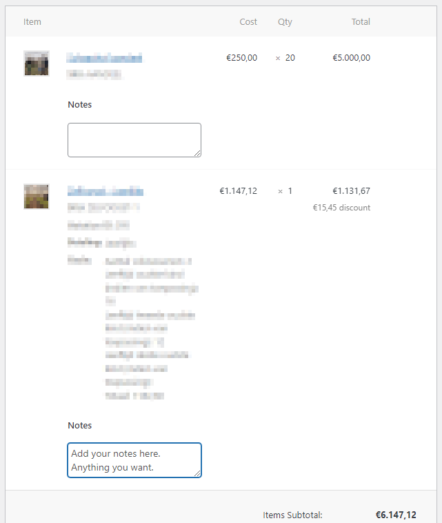

# woocommerce-order-item-notes

A plugin to allow notes on order items in WooCommerce.

You can currently add notes to a order in WooCommerce, but you can't add notes to individual order items.
This plugin makes it easy for administrators to add notes to individual order items of a WooCommerce order.

Once activated, each order item in the Admin interface will have a textbox:

Enter your notes and save the order. Your notes will now show when you load the order in the future.
